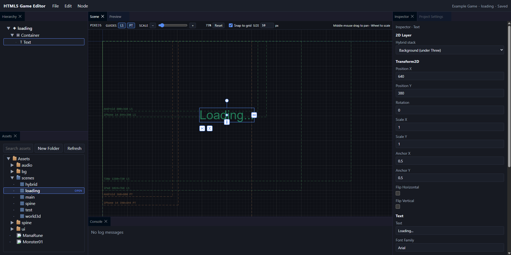

# HTML5 Game Editor

A browser-based hybrid **2D / 3D** game editor and runtime for shipping multiple HTML5 games from one TypeScript monorepo.

PixiJS handles 2D. Three.js handles 3D. React is the editor shell. Games build independently and never depend on editor code.



**[Live demo](https://andvolodko.github.io/html5-game-editor/)** — static GitHub Pages build of the editor (all `games/*` projects, no project-server). Scene edits stay in this browser (`localStorage`). Asset import needs a local `pnpm dev`.

Playable standalone builds of every game are on the same site: **[demo games](https://andvolodko.github.io/html5-game-editor/games/)** ([Editor Features Demo](https://andvolodko.github.io/html5-game-editor/games/editor-features-demo/), [MU Online](https://andvolodko.github.io/html5-game-editor/games/muonline-game/), [Solitaire](https://andvolodko.github.io/html5-game-editor/games/solitaire/)).

> Status: active development. Hybrid rendering, assets, undo/redo, prefabs, tilemaps, named node states, playable demo games, and Web/Android export are in place. Collaboration and advanced tooling are still ahead.

---

## Contents

- [Why this exists](#why-this-exists)
- [Features](#features)
- [Tech stack](#tech-stack)
- [Architecture](#architecture)
- [Repository layout](#repository-layout)
- [Getting started](#getting-started)
- [Aseprite assets](#aseprite-assets)
- [Static demo (GitHub Pages)](#static-demo-github-pages)
- [Daily commands](#daily-commands)
- [Using the editor](#using-the-editor)
- [Hotkeys](#hotkeys)
- [Working with games](#working-with-games)
- [Script components](#script-components)
- [Suggested next work](#suggested-next-work)
- [Documentation](#documentation)
- [Author](#author)
- [Acknowledgments](#acknowledgments)
- [License](#license)

---

## Why this exists

The goal is a lightweight Unity / Cocos-style workflow aimed specifically at HTML5:

- Design scenes in the browser.
- Persist them as Git-friendly JSON (stable IDs, versioned schemas).
- Play and ship games without bundling the editor.
- Mix 2D UI and 3D worlds in the same scene when needed.
- Keep Pixi and Three as adapters — never as the source of truth.

---

## Features

| Area | What you get today |
| --- | --- |
| **Editor** | Dockable panels (Hierarchy, Scene, Inspector, Assets, Asset Preview, Preview, Console, States, Project Settings), persisted layout, undo/redo, unsaved-changes guard, **File → Build Game…** |
| **2D (PixiJS 8)** | Container, Sprite, NineSlice, TilingSprite, Graphics, Text, HTMLText, BitmapText, meshes, AnimatedSprite, Spine, Tilemap, Hit Zone, Mask |
| **3D (Three.js)** | Model3D (glTF / GLB), PerspectiveCamera, DirectionalLight, AmbientLight, Transform3D |
| **Hybrid scenes** | Stacked Pixi / Three layers so UI, world, and background can share one scene |
| **Assets** | Import textures, audio, Spine, glTF/GLB, Aseprite (`.aseprite` / `.ase`), bitmap fonts, webfonts, prefabs, and tilesets; Asset Preview plays Aseprite, Spine, glTF, and audio; scenes reference stable `assetId`s |
| **Runtime** | `GameRuntime` + script components, scene flow, asset preload, HTML audio, named node states, independent Vite builds per game |
| **Export** | Web production `dist/` and Android Debug/Release APK or Release AAB (live editor + project-server; not in the GitHub Pages snapshot) |
| **Project server** | Local Node HTTP API for save/load, import, folders, project switching, and native builds — browser never gets raw filesystem access |

---

## Tech stack

| Layer | Choice |
| --- | --- |
| Language | TypeScript 5.9, strict (`noUncheckedIndexedAccess`, `verbatimModuleSyntax`) |
| Monorepo | pnpm workspaces (`apps/*`, `packages/*`, `games/*`) |
| Editor UI | React 19, Vite 7, [dockview](https://github.com/mathuo/dockview) |
| 2D renderer | PixiJS 8, Spine via `@esotericsoftware/spine-pixi-v8` |
| 3D renderer | Three.js 0.185 |
| Domain / validation | Zod schemas for scene, assets, and project JSON |
| Runtime | `@game-editor/runtime` — no React, no editor packages |
| Local backend | Node.js 20+ HTTP server (`tsx` in development) |
| Tests / quality | Vitest, ESLint (typescript-eslint), `pnpm typecheck`, `pnpm lint:deps` (dependency-cruiser), `pnpm check` |

---

## Architecture

```text
  React editor UI
        │  commands, selection, layout
        ▼
  editor-core          project-server (filesystem, import, save)
        │                         │
        ▼                         ▼
     scene / assets / project  (serializable JSON)
        │
        ▼
     runtime
        ├── renderer-pixi
        └── renderer-three
```

**Dependency rule:** arrows flow toward domain packages. Runtime must never import editor code. Serialized scenes must never contain `PIXI.*` or `THREE.*` objects.

```text
Editor  →  Scene model  →  Runtime  →  Pixi / Three
```

Games that only need 2D should depend on `renderer-pixi` and omit Three from the production bundle.

---

## Repository layout

```text
html5-game-editor/
├── apps/
│   ├── editor/            # Browser editor (React + Vite, port 5173)
│   └── project-server/    # Local project API (port 8787)
├── packages/
│   ├── core/              # Event bus, domain errors
│   ├── shared/            # IDs, ports, shared primitives
│   ├── scene/             # Scene graph, components, Zod schema
│   ├── assets/            # Asset records, resolver, metadata
│   ├── project/           # project.json + game Vite helpers
│   ├── commands/          # Undoable command contract
│   ├── editor-core/       # Editor façade, commands, managers
│   ├── game-components/   # defineComponent + shared behaviours
│   ├── runtime/           # Game loop, scene host, asset collection
│   ├── renderer-pixi/     # Pixi scene adapter
│   ├── renderer-three/    # Three scene adapter
│   ├── game-build/        # BuildTarget registry + Web Vite target
│   └── game-build-android/ # Capacitor Android APK / AAB packaging
├── games/
│   ├── editor-features-demo/      # Hybrid Pixi + Three demo (port 5174)
│   ├── muonline-game/     # Hybrid Three + Pixi HUD (port 5176)
│   └── solitaire/         # Pixi-only solitaire (port 5177)
├── docs/                  # Developer docs (index: docs/README.md)
├── PROJECT.md             # Architecture entry point (invariants + doc index)
└── pnpm-workspace.yaml
```

Editable game content lives **next to the buildable package** under `games/<name>/` (`assets/`, `project.json`, `.project/`) — not in a separate projects tree.

---

## Getting started

**Requirements**

- Node.js **≥ 20**
- [pnpm](https://pnpm.io/) **10.33+** (see `packageManager` in the root `package.json`)
- Aseprite compile: `pnpm install` downloads a packaged [LibreSprite](https://github.com/LibreSprite/LibreSprite) CLI for Windows x64, Linux x64, and macOS arm64. You can still use a system [Aseprite](https://www.aseprite.org/) / LibreSprite install instead (see [Aseprite assets](#aseprite-assets)).

```bash
pnpm install
pnpm dev
```

That starts both the editor and the project server in parallel.

| Service | URL |
| --- | --- |
| Editor | http://localhost:5173 |
| Project server | http://localhost:8787 |
| Vite `/api` proxy | Editor → project server (path prefix stripped) |

The server opens `games/editor-features-demo` by default. Override with:

```bash
# Windows (PowerShell)
$env:PROJECT_ROOT = "C:\path\to\games\solitaire"
$env:GAMES_ROOT   = "C:\path\to\games"
pnpm --filter @game-editor/project-server dev

# macOS / Linux
PROJECT_ROOT=./games/solitaire GAMES_ROOT=./games pnpm --filter @game-editor/project-server dev
```

You can also switch games from **File → Open Project** in the editor toolbar.

---

## Aseprite assets

`.aseprite` / `.ase` files are **source assets**. The editor compiles them to a packed PNG spritesheet + PixiJS JSON (animation tags → `spritesheet.animations`). Games and players never need Aseprite installed — only the generated PNG/JSON ship in the build.

Drop a file into the game `assets/` tree (or import it in the Assets panel):

```text
games/game1/assets/characters/hero.aseprite
  → games/game1/.generated/assets/characters/hero.png
  → games/game1/.generated/assets/characters/hero.json
```

The Assets panel shows the `.aseprite` file (not the generated artifacts). Select it to preview tags in the **Asset Preview** panel (below Inspector). Drag it into the scene to create a **Sprite** (single frame) or **AnimatedSprite** (tags / multiple frames; first tag is the default). Scenes store `assetId` + `animation`, never `.generated/` paths.

### CLI detection

Compile is editor/build-time only. The project server looks up an executable in this order:

1. `ASEPRITE` environment variable (full path to `aseprite` / `libresprite`)
2. `PATH` (`aseprite`, `Aseprite.exe`, `libresprite`, `libresprite.exe`)
3. Well-known install folders (Program Files, Steam, `%LOCALAPPDATA%\Programs\Aseprite`, `%LOCALAPPDATA%\Programs\LibreSprite`, macOS `/Applications`, `/usr/bin`)
4. Packaged LibreSprite from `pnpm install` (`apps/project-server/vendor/libresprite`)

`pnpm install` (project-server `postinstall`) downloads LibreSprite **v1.1** for Windows x64, Linux x64, and macOS arm64 (~50MB). CI skips that download (`CI=true`); generated PNG/JSON stay committed so Pages builds do not need the CLI. Re-run `pnpm install-libresprite` if the download was skipped or failed.

If nothing is found, the editor stays up and the asset shows:

```text
Aseprite CLI was not found.

Run `pnpm install-libresprite`, or install Aseprite / LibreSprite and make sure `aseprite` or `libresprite` is available in PATH (or set the ASEPRITE environment variable).
```

Restart `pnpm dev` after installing a CLI so the server picks it up.

**LibreSprite** (free) is enough for spritesheet + tag export. The packaged copy lives under `apps/project-server/vendor/libresprite` (gitignored). A manual Windows install can also live at:

```text
%LOCALAPPDATA%\Programs\LibreSprite\libresprite.exe
```

Unchanged files are skipped using `.project/aseprite-cache.json` (mtime + size). That cache file and `.generated` undo trash stay gitignored. Derived PNG/JSON under `games/*/.generated` are committed so GitHub Actions / Pages can build the demo without the Aseprite CLI.

Full pipeline, serialization, and runtime notes: [`docs/aseprite.md`](./docs/aseprite.md).

---

## Static demo (GitHub Pages)

The hosted site is a **static Vite build**. It does not run `project-server`. The editor bundles every package under `games/` (scenes, `project.json`, asset catalogue) and serves files from `/demo/<project-id>/assets` plus `/demo/<project-id>/_generated`. Switch games with **File → Open Project**.

Each `games/<id>` package is also built as a standalone player and copied to `/games/<id>/`. New games are picked up automatically — no workflow edit.

| Works in the demo | Needs local `pnpm dev` |
| --- | --- |
| Hierarchy, viewport, gizmos, inspector | Asset import / folder create |
| Undo/redo, save scene (this browser) | Real filesystem persistence |
| Asset browser, Preview, States, script components | **File → Build Game…** (Web and Android) |
| Open any bundled `games/*` project | |
| Play `/games/<id>/` without the editor | |

```bash
pnpm dev:demo          # editor only, no project-server
pnpm build:demo        # editor snapshot in apps/editor/dist
pnpm build:pages       # editor + every games/* player (GitHub Pages artifact)
```

Push to `master` runs **CI**; a successful CI run deploys Pages (quality gates stay in CI, not in the deploy workflow). In the repo: **Settings → Pages → Source: GitHub Actions**.

---

## Daily commands

| Command | Purpose |
| --- | --- |
| `pnpm dev` | Editor + project server |
| `pnpm dev:editor` | Editor only (expects project-server on port 8787) |
| `pnpm dev:demo` | Editor only (static snapshot of every `games/*` project) |
| `pnpm build:demo` | Static editor snapshot (`apps/editor/dist`) |
| `pnpm build:pages` | Editor + standalone `games/*` builds for GitHub Pages |
| `pnpm build:games` | Production Vite build of every `games/*` package |
| `pnpm test` | Vitest across workspaces |
| `pnpm typecheck` | `tsc --noEmit` across workspaces |
| `pnpm lint` | ESLint (`--max-warnings=0` in packages that define it) |
| `pnpm lint:deps` | dependency-cruiser package-boundary rules |
| `pnpm check` | typecheck + lint + lint:deps + test |
| `pnpm build` | Build packages, then apps and games |

Per-package / per-game:

```bash
pnpm --filter @game-editor/editor dev
pnpm --filter @game-editor/project-server dev

pnpm --filter @games/editor-features-demo dev
pnpm --filter @games/editor-features-demo build
pnpm --filter @games/muonline-game dev
pnpm --filter @games/solitaire dev

pnpm --filter @game-editor/game-build-android build:debug -- games/editor-features-demo
```

Game Vite configs import TypeScript from `@game-editor/project/vite`, and the editor config imports `@game-editor/assets` via the demo plugin, so those scripts use `--configLoader runner`. Android packaging: [`docs/android-export.md`](./docs/android-export.md).

---

## Using the editor

Default docking layout:

```text
┌─────────────────────────────────────────────────────┐
│ Toolbar  (File / Edit / Node, undo, save, project)  │
├────────────┬──────────────────────────┬─────────────┤
│ Hierarchy  │ Scene viewport           │ Inspector   │
│            │ (Pixi + Three, gizmos)   ├─────────────┤
│            │                          │ Asset Preview│
├────────────┼──────────────────────────┤             │
│ Assets     │ Preview / Console / States│            │
└────────────┴──────────────────────────┴─────────────┘
```

Typical loop:

1. Open a game project.
2. Create or select nodes in Hierarchy / Scene.
3. Assign textures, Aseprite, Spine, audio, fonts, tilesets, prefabs, or glTF from the Asset Browser (import via drag-and-drop).
4. Tune transforms and visual fields in the Inspector; add Script components from **Add Component**. Named property overrides use the **States** panel.
5. Save the scene (dirty state is tracked against the last saved snapshot).
6. Use **Preview** to run the game runtime inside the editor (Play / Pause / Stop), or `pnpm --filter @games/<name> dev` for a standalone window.
7. Use **File → Build Game…** for a Web `dist/` or an Android APK/AAB (Android needs `pnpm dev`, not the Pages demo). Details: [`docs/android-export.md`](./docs/android-export.md).

Meaningful edits go through commands so undo/redo stays consistent. Drag gestures commit **one** command on pointer-up, not one per mouse move.

Keyboard shortcuts (undo/redo, save, duplicate, Assets keys, 3D gizmos): [`docs/hotkeys.md`](./docs/hotkeys.md).

---

## Hotkeys

See **[`docs/hotkeys.md`](./docs/hotkeys.md)** for the full list. Common chords:

| Action | Shortcut |
| --- | --- |
| Undo | Ctrl+Z (Cmd+Z on macOS) |
| Redo | Ctrl+Y or Ctrl+Shift+Z |
| Save | Ctrl+S |
| Duplicate node | Ctrl+D |

---

## Working with games

Each game is a workspace package:

```text
games/editor-features-demo/
├── project.json           # display name, resolution, start scene, renderers
├── .project/assets.json   # asset database (stable IDs)
├── assets/scenes/         # versioned scene JSON
├── src/main.ts            # boot GameRuntime, register components
├── src/components/        # game-specific Script behaviours
├── package.json
└── vite.config.ts
```

`project.json` example:

```json
{
  "name": "editor-features-demo",
  "version": 1,
  "displayName": "Editor Features Demo",
  "renderers": ["pixi", "three"],
  "startScene": "loading",
  "resolution": { "width": 1280, "height": 720 },
  "background": "#1c2a4a"
}
```

To add a new game, follow `.cursor/skills/create-game/SKILL.md` (or copy `games/solitaire` for Pixi-only, `games/editor-features-demo` / `games/muonline-game` for hybrid). Give it a unique Vite port, and register components from `src/components`. Keep Three out of `dependencies` if the game never uses 3D. Keep Pixi out if the game never uses 2D.

From a live editor (`pnpm dev`), **File → Build Game…** writes a Web production `dist/` or an Android Debug/Release APK / Release AAB. Android toolchain and CLI: [`docs/android-export.md`](./docs/android-export.md).

---

## Script components

Gameplay is composition, not deep node inheritance:

```text
Node
├── Transform2D
├── Sprite
└── Script (e.g. shared.ChangeScene)
```

Define behaviours with `defineComponent` and an OOP class that implements `ScriptInstance`. Step-by-step: [`docs/guides/add-a-script-component.md`](./docs/guides/add-a-script-component.md).

| Kind | Location | ID prefix |
| --- | --- | --- |
| Game-specific | `games/<name>/src/components/` | `<game>.PascalName` |
| Shared | `packages/game-components/src/shared/` | `shared.PascalName` |

Built-in shared components today: **Change Scene**, **Load All Scene Assets**, **Performance Meter**, **Audio Click**, **Background Audio**, **Button**.

Shared components must stay runtime-safe: no React, Pixi, Three, or `editor-core`.

---

## Suggested next work

The architecture described in [`PROJECT.md`](./PROJECT.md) and [`docs/`](./docs/) is larger than the current product. Highest-leverage additions (also listed in [`docs/roadmap.md`](./docs/roadmap.md)):

### Editor & content pipeline

- **Prefab variants & structural overrides** — property overrides, unpack, and nested resolution are in; variants and delete/reparent of inherited children are not
- **Spritesheet / atlas generation** — Aseprite/LibreSprite compile and BitmapText (BMFont) import are in; still needed: pack loose PNGs
- **Timeline & animation** — clip editing for Spine, AnimatedSprite, and glTF animations
- **Particles, filters** — Pixi ParticleContainer is deferred; filters are still design-only
- **Richer 3D** — HDR environments, shadows, materials, post-processing (extension points exist; implementations do not)

### Runtime & games

- **Physics** — optional 2D/3D adapter that stays out of serialized scene data
- **Input map** — named actions instead of ad-hoc pointer handlers in each behaviour
- **Audio mixer** — buses, volume, and spatial playback beyond HTML audio / Background Audio
- **UI layout** — layout component for 2D UI (tilemaps are already supported)
- **Optional renderer hygiene** — ensure Pixi-only games never statically import Three

### Collaboration & operations

- **Multi-user locking** — resource locks + heartbeat so two editors cannot clobber the same scene
- **Project-server auth** — CORS is `*` for local dev only; do not widen trust without an explicit product decision

### Quality

- **Schema migrations** — versioned scene/project JSON already exists; add an explicit migration runner and fixtures
- **Play-mode isolation** — clearer edit vs play state so preview cannot leak into the document
- **Structured logging** — feed editor/runtime logs into the Console panel instead of ad-hoc `console` calls

When adding a feature, keep the mutation path:

```text
UI  →  Command  →  Domain model  →  Renderer sync
```

Do not mutate `PIXI.Sprite` or `THREE.Object3D` from React.

---

## Documentation

Developer index (how-tos and topic pages): **[`docs/README.md`](./docs/README.md)**.

| Doc | Use it for |
| --- | --- |
| [`PROJECT.md`](./PROJECT.md) | Orientation, critical invariants, and which detailed doc to open |
| [`CONTRIBUTING.md`](./CONTRIBUTING.md) | How to run checks, invariants, and where to read before a PR |
| [`docs/guides/add-a-script-component.md`](./docs/guides/add-a-script-component.md) | Add a Script behaviour (Inspector + runtime) |
| [`docs/guides/use-node-states.md`](./docs/guides/use-node-states.md) | Named property overrides (States panel + `ctx.node.states`) |
| [`docs/architecture.md`](./docs/architecture.md) | Package boundaries, quality, errors, performance |
| [`docs/scene-model.md`](./docs/scene-model.md) | Scene graph, components, serialization, prefabs, named states |
| [`docs/assets.md`](./docs/assets.md) | Asset database, import, atlas, generated files |
| [`docs/editor.md`](./docs/editor.md) | Editor core, commands, undo, inspector, selection, layout, node states |
| [`docs/runtime.md`](./docs/runtime.md) | Game runtime, independent builds, optional renderers |
| [`docs/renderers.md`](./docs/renderers.md) | Pixi / Three adapters and hybrid layers |
| [`docs/project-server.md`](./docs/project-server.md) | Filesystem API and path confinement |
| [`docs/android-export.md`](./docs/android-export.md) | Web BuildTarget + Capacitor Android APK / AAB |
| [`docs/collaboration.md`](./docs/collaboration.md) | Resource locking and Git collaboration |
| [`docs/roadmap.md`](./docs/roadmap.md) | MVP phases and planned work |
| [`docs/hotkeys.md`](./docs/hotkeys.md) | Editor keyboard shortcuts |
| [`docs/aseprite.md`](./docs/aseprite.md) | Aseprite / LibreSprite pipeline |
| `.cursor/rules/` | Path-scoped constraints (editor UI, commands, server security, TypeScript) |
| `.cursor/skills/` | Workflows: create-game, create-game-component, add-node-type, add-asset-type, add-editor-command, add-editor-panel, implement-editor-feature, implement-runtime-feature, architecture-change |

---

## Author

Created and written by **[Andrii Volodko](https://github.com/andvolodko)**.

---

## Acknowledgments

This project was developed with [Cursor](https://cursor.com) using **cursor-grok-4.6-high-fast** and **cursor-grok-4.6-high**.

---

## License

Released under the [MIT License](./LICENSE). Copyright © 2026 Andrii Volodko.
